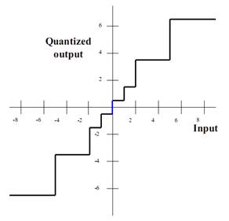

## Introduction

**About the Experiment**

This experiment enables a student to learn

<ul>
                    <li>understand different types of non-uniform quantization techniques.</li>
                    <li>Know about the compression and expansion process involved in companding technique.</li>
                    <li>The principal objective of this experiment is to understand the principle of A-Law and μ-Law Companding techniques.</li>
                </ul>

## Theory

                            
                            
Companding

                            
In previous experiment we considered an Analog to Digital Converter (ADC) where the quantizer was 
                                uniformly spaced against amplitude axis. This allows uniform resolution or step size for the entire range of the signal. 
                                The resulting error or quantization noise is also same for all the amplitude levels. While this appears to be a very 
                                logical way of quantizing signal if quantization error / noise is perceived uniformly across all amplitude levels, there 
                                are occasions when it is not actually so. For example, human auditory system follows what can be related to a logarithmic
                                process in which high amplitude sounds do not require the same resolution as low amplitude sounds. The human ear is more 
                                sensitive to quantization noise in small amplitude signals than the large ones 

                            
  Companding is combination of two terms compressing and expanding. In the context of quantization, 
                                this refers to compressing the higher amplitude signal first through a non-uniform quantization process and then expanding 
                                it to get back the signal. To obtain non-uniform quantization a two step process may be followed - first pass the signal 
                                through a compressor and then compress it by a uniform quantizer (discussed in second experiment).

                            
In speech coding, in an attempt to follow the human auditory system A-law and mu-law companding 
                                are used. Both apply logarithmic quantization functions to adjust the bit resolution in proportion to the level of the 
                                input signal. Smaller signals are represented with greater precision or more data bits and larger signals with less data 
                                bits. The result is fewer bits per sample to maintain an audible signal-to-noise ratio (SNR). Note the term 'audible'.
                                Audible SNR is the perceived SNR and not actual SNR.

                            
The sampled discrete time signal x(nT) , n=0,1,2,.... of the original continuous time signal x(t)
                                is shown in Fig. 2 below.

                            
For computational ease, A-law and m-law companding match logarithmic curve with a piece-wise
                                linear approximation. This first sets eight straight-line segments along the curve to produce a close approximation to 
                                the logarithm function. Each segment is known as a chord. Within each chord, the piece-wise linear approximation is 
                                divided into equally size quantization intervals called steps. The step size between adjacent codewords is doubled in 
                                each succeeding chord. Also encoded is the sign bit for the original integer. The result is an 8-bit logarithmic code 
                                composed of a 1-bit sign bit, a 3-bit chord, and a 4-bit step.

                            
<b>A-Law Compander</b>

                            
A-law is the CCITT recommended companding standard that is used across Europe and rest of the 
                                countries except Japan, Canada and North America. Limiting the linear sample values to 12 magnitude bits, the A-law 
                                compression is defined by Equation 1, where A is the compression parameter (A=87.7 in Europe), and x is the normalized 
                                signal to be compressed.

